# NFT Marketplace on Avalanche

Step by step tutorial to build your own NFT marketplace on Avalanche using Hardhat and React.

# Table of contents

- [NFT Marketplace on Avalanche](#nft-marketplace-on-avalanche)
- [Table of contents](#table-of-contents)
- [Generating files](#generating-files)
- [Creating the NFT Token](#creating-the-nft-token)
- [Contracts for the marketplace](#contracts-for-the-marketplace)
  - [Auction Contract](#auction-contract)
    - [Starting with the functions](#starting-with-the-functions)
    - [Events](#events)
    - [Storage variables](#storage-variables)
    - [Constructor function](#constructor-function)
    - [Building the functions](#building-the-functions)
      - [Get the auction state](#get-the-auction-state)
      - [Placing bids](#placing-bids)
      - [Cancel auction](#cancel-auction)
      - [Withdraw Token](#withdraw-token)
      - [Withdraw Funds](#withdraw-funds)
      - [Get all bids](#get-all-bids)
  - [Auction Manager Contract](#auction-manager-contract)
    - [Building the functions](#building-the-functions-1)
      - [Create auction](#create-auction)
      - [Get Auctions](#get-auctions)
- [AVAX Fuji Testnet](#avax-fuji-testnet)
- [Deploying the contracts](#deploying-the-contracts)
- [React App](#react-app)
  - [Building the form](#building-the-form)
  - [Interacting with contracts](#interacting-with-contracts)
    - [Contract ABI's](#contract-abis)
    - [Detecting and connecting to metamask](#detecting-and-connecting-to-metamask)
  - [Minting an NFT](#minting-an-nft)
  - [Owned NFT's](#owned-nfts)
  - [Creating an auction](#creating-an-auction)
  - [Getting the list of auctions](#getting-the-list-of-auctions)
  - [Building the auction page](#building-the-auction-page)
    - [Rendering the selected auction](#rendering-the-selected-auction)
  - [Auction Functions](#auction-functions)
    - [Placing Bids](#placing-bids-1)
    - [Withdraw Token](#withdraw-token-1)
    - [Withdraw Funds](#withdraw-funds-1)
    - [Cancel Auction](#cancel-auction-1)
  - [Polishing the buttons](#polishing-the-buttons)
    - [Place Bid Area](#place-bid-area)
    - [Cancel Auction Button](#cancel-auction-button)
    - [Withdraw Funds Button](#withdraw-funds-button)
    - [Withdraw Token Button](#withdraw-token-button)
  - [Finishing the React App](#finishing-the-react-app)
- [Using With Other NFT Contracts](#using-with-other-nft-contracts)
- [Next Steps](#next-steps)
  - [Tests](#tests)
  - [Things to consider](#things-to-consider)
- [Deploying to the Avalanche Mainnet](#deploying-to-the-avalanche-mainnet)
- [Conclusion](#conclusion)

# Generating files

Let's get started by setting up [Hardhat](https://hardhat.org/).

- `npx hardhat init` -> choose sample project
- Delete the `Greeter.sol` file inside contracts

# Creating the NFT Token

First, we need to create an NFT token that will be displayed in our marketplace.

Let's create a simple ERC-721 token.

[NFT.sol](contracts/NFT.sol)

```solidity
contract NFT is ERC721 {
  using Counters for Counters.Counter;
  Counters.Counter private _tokenIds;
  mapping (uint => uint) public itemValue;
  uint maxValue = 10000; // Max value of an item

  constructor() ERC721("Super NFT", "SPRNFT") {}

  /**
    Returns a random number
  */
  function random() private view returns (uint) {
        return uint(keccak256(abi.encodePacked(block.difficulty, block.timestamp, block.number)));
  }

  function myItems() external view returns (uint[] memory items) {
    // Returns an array of items that the user owns
    items = new uint[](balanceOf(msg.sender));
    uint _counter = 0;
    for(uint i = 1; i < _tokenIds.current(); i++) { // i = 1 because the token counter is increased before the id is assigned
      if(ownerOf(i) == msg.sender) { // if the user owns the item
        items[_counter] = i; // add the item to the array
        _counter++; // increase the counter
      }
    }
    return items;
  }

  function getItem() payable public returns (uint256) {
    require(msg.value == 0.5 ether); // 0.5 AVAX is the cost of an item
    _tokenIds.increment(); // Increase the counter
    uint256 newItemId = _tokenIds.current(); // Get the current counter value
    _mint(msg.sender, newItemId); // Mint the new item to the user
    itemValue[newItemId] = random() % maxValue; // Set the item value to a random number modulus used to make sure that the value isn't bigger than maxValue
    return newItemId; // Return the new item id
  }
}
```

> Note: Secure random-number generation in the blockchain is a very difficult problem. Our method here is insecure, but since this is just an example, it will be good enough for our purposes.

The logic here is very simple.

- User calls the getItem() function and pays 0.5 AVAX
- The value of the token is determined using a random number.
- The token is minted to the user.

And that's all.

# Contracts for the marketplace

We will have two contracts, `AuctionManager` and `Auction` contracts. AuctionManager contract will create the auctions by deploying the Auction contract using the parameters.
Here is how it will work:

- The auction creator enters parameters for direct buy price, starting price, minimum bid increment, the token id, and the auction end time.
- The auction creator gives approval for the NFT that will be auctioned to the AuctionManager.
- The AuctionManager creates an Auction with the parameters given and then transfers the NFT to the newly created Auction contract.
- After the auction is completed creator and the auction winner must call the withdrawal functions.

Let's begin with the `Auction` contract.

## Auction Contract

### Starting with the functions

Our auction contract will allow users to place bids, cancel the auction if there are no bids and withdraw their tokens and funds after the auction has been completed. We will also need a function to get the current state of the auction.

```solidity
contract Auction {
    function placeBid() payable external returns(bool){} // Place a bid on the auction
    function withdrawToken() external returns(bool){} // Withdraw the token after the auction is over
    function withdrawFunds() external returns(bool){} // Withdraw the funds after the auction is over
    function cancelAuction() external returns(bool){} // Cancel the auction
    function getAuctionState() public view returns(uint) {} // Get the auction state
    function allBids() external view returns (address[] memory, uint256[] memory) {} // Returns a list of all bids and addresses
}
```

### Events

There will be four events in the contract.
`NewBid` will be emitted each time there is a new bid.
`WithdrawToken` will be emitted when the highest bidder withdraws the token.
`WithdrawFunds` will be emitted when the auction owner withdraws the funds.
`AuctionCancelled` will be emitted when the auction gets canceled.

```solidity
contract Auction {
    event NewBid(address bidder, uint bid); // A new bid was placed
    event WithdrawToken(address withdrawer); // The auction winner withdrawed the token
    event WithdrawFunds(address withdrawer, uint256 amount); // The auction owner withdrawed the funds
    event AuctionCancelled(); // The auction was cancelled
}
```

### Storage variables

We will need to store a few variables.

- `endTime` is the end timestamp of the auction. The auction will end if the current timestamp is equal or greater than the `endTime`.
- `startTime` is the timestamp that marks the start of the auction.
- `maxBid` the amount of max bid.
- `maxBidder` is the address of the max bidder.
- `creator` is the address of the auction creator.
- `bids` array of bids, we will use this to display recent bids on the web page.
- `tokenId` is the id of the token that has been auctioned.
- `isCancelled` will be true if the auction has been canceled.
- `isDirectBuy` will be true if someone placed a bit with a higher or equal value than the direct buy price.
- `minIncrement` is the minimum increment for the bid.
- `directBuyPrice` is the price for a direct buy.
- `startPrice` is the starting price for the auction.
- `nftAddress` is the address of the NFT contract
- `_nft` is the NFT token.

```solidity
contract Auction {
    uint256 public endTime; // Timestamp of the end of the auction (in seconds)
    uint256 public startTime; // The block timestamp which marks the start of the auction
    uint maxBid; // The maximum bid
    address maxBidder; // The address of the maximum bidder
    address creator; // The address of the auction creator
    Bid[] public bids; // The bids made by the bidders
    uint tokenId; // The id of the token
    bool isCancelled; // If the the auction is cancelled
    bool isDirectBuy; // True if the auction ended due to direct buy
    uint minIncrement; // The minimum increment for the bid
    uint directBuyPrice; // The price for a direct buy
    uint startPrice; // The starting price for the auction
    IERC721 _nft; // The NFT token

    enum AuctionState {
        OPEN,
        CANCELLED,
        ENDED,
        DIRECT_BUY
    }

    struct Bid { // A bid on an auction
        address sender;
        uint256 bid;
    }
}
```

We would be using block numbers instead of timestamps. If we were developing this application on another chain such as Ethereum Mainnet, block timestamps are being set by the miners, and they are spoofable.
However, in Avalanche, there is no set block rate; thus, we cannot rely on block numbers. We will be using `block.timestamp` to measure time. Timestamps are guaranteed to be within 30 seconds of real-time therefore we do not need to worry about it. [Read more about it here.](https://support.avax.network/en/articles/5106526-measuring-time-in-smart-contracts)

The auction will end when the current timestamp is greater than or equal to the `endTime` which holds the timestamp the end of the auction.

### Constructor function

We will need to get some parameters from the `AuctionManager` contract.

```solidity
constructor(address _creator,uint _endTime,uint _minIncrement,uint _directBuyPrice, uint _startPrice,address _nftAddress,uint _tokenId){
    creator = _creator; // The address of the auction creator
    endTime = block.timestamp +  _endTime; // The timestamp which marks the end of the auction (now + 30 days = 30 days from now)
    startBlock = block.timestamp; // The timestamp which marks the start of the auction
    minIncrement = _minIncrement; // The minimum increment for the bid
    directBuyPrice = _directBuyPrice; // The price for a direct buy
    startPrice = _startPrice; // The starting price for the auction
    _nft = IERC721(_nftAddress); // The address of the nft token
    nftAddress = _nftAddress;
    tokenId = _tokenId; // The id of the token
    maxBidder = _creator; // Setting the maxBidder to auction creator.
}
```

### Building the functions

#### Get the auction state

Let's start with the `getAuctionState` function as we are going to use it in other functions.
First, we need to check if the auction has been canceled and return `AuctionState.CANCELLED` if it is.
Then, we need to check if anyone bid more or equal to the direct buy price and return `AuctionState.DIRECT_BUY` in that case.
Then, we need to check if the current timestamp is greater or equal to the `endTime` and return `AuctionState.ENDED` in that case.
Otherwise, we will return `AuctionState.OPEN`.

```solidity
// Get the auction state
function getAuctionState() public view returns(AuctionState) {
    if(isCancelled) return AuctionState.CANCELLED; // If the auction is cancelled return CANCELLED
    if(isDirectBuy) return AuctionState.DIRECT_BUY; // If the auction is ended by a direct buy return DIRECT_BUY
    if(block.timestamp >= endTime) return AuctionState.ENDED; // The auction is over if the block timestamp is greater than the end timestamp, return ENDED
    return AuctionState.OPEN; // Otherwise return OPEN
}
```

#### Placing bids

Let's start building the place bid function.
The user calls the `placeBid` function and sends an amount of AVAX.

Firstly, there are few things we need to check;

- The bidder cannot be the auction creator
- The auction should be open.
- The bid should be greater than the start price.
- The bid should be greater than the highest bid + minimum bid increment.

```solidity
function placeBid() payable external returns(bool){
    require(msg.sender != creator); // The auction creator can not place a bid
    require(getAuctionState() == AuctionState.OPEN); // The auction must be open
    require(msg.value > startPrice); // The bid must be higher than the starting price
    require(msg.value > maxBid + minIncrement); // The bid must be higher than the current bid
}
```

Next, we will set the new max bid and the max bidder. After that, we will store the value of the last highest bid and the bidder because we will need this information later.

```solidity
address lastHightestBidder = maxBidder; // The address of the last highest bidder
uint256 lastHighestBid = maxBid; // The last highest bid
maxBid = msg.value; // The new highest bid
maxBidder = msg.sender; // The address of the new highest bidder
```

Next, we have to check if the bid (`msg.value`) is greater or equal to the direct buy price. In that case, we will need to set the `isDirectBuy` to `true`, thus end the auction.

```solidity
if(msg.value >= directBuyPrice){ // If the bid is higher or equal to the direct buy price
    isDirectBuy = true; // The auction has ended
}
```

Next, we have to push the value of the new bid into the bids array.

```solidity
bids.push(Bid(msg.sender,msg.value));
```

Finally, if there is a previous bid, we have to refund the previous highest bid to the previous bidder. Also, we should emit a NewBid event.

```solidity
if(lastHighestBid != 0){ // if there is a bid
    address(uint160(lastHightestBidder)).transfer(lastHighestBid); // refund the previous bid to the previous highest bidder
}

emit NewBid(msg.sender,msg.value); // emit a new bid event

return true;
```

Here is the complete function

```solidity
// Place a bid on the auction
function placeBid() payable external returns(bool){
    require(msg.sender != creator); // The auction creator can not place a bid
    require(getAuctionState() == AuctionState.OPEN); // The auction must be open
    require(msg.value > startPrice); // The bid must be higher than the starting price
    require(msg.value > maxBid + minIncrement); // The bid must be higher than the current bid + the minimum increment

    address lastHightestBidder = maxBidder; // The address of the last highest bidder
    uint256 lastHighestBid = maxBid; // The last highest bid
    maxBid = msg.value; // The new highest bid
    maxBidder = msg.sender; // The address of the new highest bidder
    if(msg.value >= directBuyPrice){ // If the bid is higher than the direct buy price
        isDirectBuy = true; // The auction has ended
    }
    bids.push(Bid(msg.sender,msg.value)); // Add the new bid to the list of bids

    if(lastHighestBid != 0){ // if there is a bid
        address(uint160(lastHightestBidder)).transfer(lastHighestBid); // refund the previous bid to the previous highest bidder
    }

    emit NewBid(msg.sender,msg.value); // emit a new bid event
    return true; // The bid was placed successfully
}
```

#### Cancel auction

This is a very simple function. If there are no bids and the auction is open, the auction creator should be able to cancel the auction.

```solidity
function cancelAuction() external returns(bool){ // Cancel the auction
    require(msg.sender == creator); // Only the auction creator can cancel the auction
    require(getAuctionState() == AuctionState.OPEN); // The auction must be open
    require(maxBid == 0); // The auction must not be cancelled if there is a bid
    isCancelled = true; // The auction has been cancelled
    _nft.transferFrom(address(this), creator, tokenId); // Transfer the NFT token to the auction creator
    emit AuctionCanceled(); // Emit Auction Canceled event
    return true;
}
```

#### Withdraw Token

After the auction has been completed, the highest bidder should be able to withdraw the NFT token.
The `msg.sender` must be the highest bidder and the auction must be completed by either direct buy or timeout, otherwise the function must revert. After that, The NFT with the token id `tokenId` will be transferred to the highest bidder.

We've set the max bidder initial value to the auction creator's wallet address, so if the auction times out and no one bids, the auction creator will be able to withdraw the token.

```solidity
// Withdraw the token after the auction is over
function withdrawToken() external returns(bool){
    require(getAuctionState() == AuctionState.ENDED || getAuctionState() == AuctionState.DIRECT_BUY); // The auction must be ended by either a direct buy or timeout
    require(msg.sender == maxBidder); // The highest bidder can only withdraw the token
    _nft.transferFrom(address(this), maxBidder, tokenId); // Transfer the token to the highest bidder
    emit WithdrawToken(maxBidder); // Emit a withdraw token event
}
```

#### Withdraw Funds

After the auction has been completed, the auction creator should be able to withdraw the funds.
The `msg.sender` must be the auction owner and the auction must be completed by either a direct buy or timeout; otherwise, the function must revert. After that, the max bid amount must be transferred to the auction creator.

```solidity
// Withdraw the funds after the auction is over
function withdrawFunds() external returns(bool){
    require(getAuctionState() == AuctionState.ENDED || getAuctionState() == AuctionState.DIRECT_BUY); // The auction must be ended by either a direct buy or timeout
    require(msg.sender == creator); // The auction creator can only withdraw the funds
    address(uint160(msg.sender)).transfer(maxBid);
    emit WithdrawFunds(msg.sender,maxBid); // Emit a withdraw funds event
}
```

#### Get all bids

We will need a function to get all bids and the bidders.

```solidity
// Returns a list of all bids and addresses
function allBids()
  external
  view
  returns (address[] memory, uint256[] memory)
{
    address[] memory addrs = new address[](bids.length);
    uint256[] memory bidPrice = new uint256[](bids.length);
    for (uint256 i = 0; i < bids.length; i++) {
        addrs[i] = bids[i].sender;
        bidPrice[i] = bids[i].bid;
    }
      eturn (addrs, bidPrice);
}
```

And that's all. Our Auction contract is ready.
[Auction Contract](contracts/Auction.sol)

## Auction Manager Contract

We will use this contract to get a list of all auctions, and to create new ones.
Let's start with the basic structure.

```solidity
pragma solidity ^0.7.0;

import "./Auction.sol";
import "@openzeppelin/contracts/token/ERC721/IERC721.sol";

contract AuctionManager {
    uint _auctionIdCounter; // auction Id counter
    mapping(uint => Auction) public auctions; // auctions

    function createAuction(uint _endTime, uint _minIncrement, uint _directBuyPrice,uint _startPrice,address _nftAddress,uint _tokenId) external returns (bool) {} // create an auction
    function getAuctions() external view returns(address[] memory _auctions) {} // Return a list of all auctions
    function getAuctionInfo(address[] calldata _auctionsList) external view
      returns (
            uint256[] memory directBuy,
            address[] memory owner,
            uint256[] memory highestBid,
            uint256[] memory tokenIds,
            uint256[] memory endTime,
            uint256[] memory startPrice,
            uint256[] memory auctionState
      ) {} // Return the information of each auction address
}
```

We will need two functions, one for creating an auction and the other one for getting a list of auctions. We will use the counter to assign a unique id for each auction so we can keep track of them.

### Building the functions

#### Create auction

This is a very straightforward function.

First, we need to check that:

- Direct buy price is greater than zero.
- Start price is greater than the direct buy price.
- End time is greater than 5 minutes, so no one will be able to create an auction that lasts few seconds. That wouldn't make sense.

```solidity
require(_directBuyPrice > 0); // direct buy price must be greater than 0
require(_startPrice < _directBuyPrice); // start price is smaller than direct buy price
require(_endTime > 5 minutes); // end time must be greater than 5 minutes (setting it to 5 minutes
```

Then, we will create a new Auction contract using the parameters and assign an id to it.

```solidity
uint auctionId = _auctionIdCounter; // get the current value of the counter
_auctionIdCounter++; // increment the counter
Auction auction = new Auction(msg.sender, _endTime, _minIncrement, _directBuyPrice, _startPrice, _nftAddress, _tokenId); // create the auction
```

Finally, we will transfer the NFT token to the newly generated Auction contract and update our auctions map.

```solidity
IERC721 _nftToken = IERC721(_nftAddress); // get the nft token
_nftToken.transferFrom(msg.sender, address(auction), _tokenId); // transfer the token to the auction
auctions[auctionId] = auction; // add the auction to the map
return true;
```

```solidity
// create an auction
function createAuction(uint _endTime, uint _minIncrement, uint _directBuyPrice,uint _startPrice,address _nftAddress,uint _tokenId) external returns (bool){
    require(_directBuyPrice > 0); // direct buy price must be greater than 0
    require(_startPrice < _directBuyPrice); // start price is smaller than direct buy price
    require(_endTime > 5 minutes); // end time must be greater than 5 minutes (setting it to 5 minutes for testing you can set it to 1 days or anything you would like)

    uint auctionId = _auctionIdCounter; // get the current value of the counter
    _auctionIdCounter++; // increment the counter
    Auction auction = new Auction(msg.sender, _endTime, _minIncrement, _directBuyPrice, _startPrice, _nftAddress, _tokenId); // create the auction
    IERC721 _nftToken = IERC721(_nftAddress); // get the nft token
    _nftToken.transferFrom(msg.sender, address(auction), _tokenId); // transfer the token to the auction
    auctions[auctionId] = auction; // add the auction to the map
    return true;
}
```

#### Get Auctions

This function will iterate over all auctions and return a list of auction addresses.

```solidity
// Return a list of all auctions
function getAuctions() external view returns(address[] memory _auctions) {
    _auctions = new address[](_auctionIdCounter); // create an array of size equal to the current value of the counter
    for(uint i = 0; i < _auctionIdCounter; i++) { // for each auction
        _auctions[i] = address(auctions[i]); // add the address of the auction to the array
    }
    return _auctions; // return the array
}
```

Then we can use this list of auctions to display them on the web page. We will need a function to obtain information about the auctions. Given an array of auction addresses we would like to get direct buy price, auction creator, starting price, highest bid, token id, auction state, and the end time.

```solidity
// Return the information of each auction address
function getAuctionInfo(address[] calldata _auctionsList)
    external
    view
    returns (
        uint256[] memory directBuy,
        address[] memory owner,
        uint256[] memory highestBid,
        uint256[] memory tokenIds,
        uint256[] memory endTime,
        uint256[] memory startPrice,
        uint256[] memory auctionState
    )
{
    directBuy = new uint256[](_auctionsList.length); // create an array of size equal to the length of the passed array
    owner = new address[](_auctionsList.length); // create an array of size equal to the length of the passed array
    highestBid = new uint256[](_auctionsList.length);
    tokenIds = new uint256[](_auctionsList.length);
    endTime = new uint256[](_auctionsList.length);
    startPrice = new uint256[](_auctionsList.length);
    auctionState = new uint256[](_auctionsList.length);

    for (uint256 i = 0; i < _auctionsList.length; i++) { // for each auction
        directBuy[i] = Auction(auctions[i]).directBuyPrice(); // get the direct buy price
        owner[i] = Auction(auctions[i]).creator(); // get the owner of the auction
        highestBid[i] = Auction(auctions[i]).maxBid(); // get the highest bid
        tokenIds[i] = Auction(auctions[i]).tokenId(); // get the token id
        endTime[i] = Auction(auctions[i]).endTime(); // get the end time
        startPrice[i] = Auction(auctions[i]).startPrice(); // get the start price
        auctionState[i] = uint(Auction(auctions[i]).getAuctionState()); // get the auction state
    }

    return ( // return the arrays
        directBuy,
        owner,
        highestBid,
        tokenIds,
        endTime,
        startPrice,
        auctionState
    );
}
```

See the full [AuctionManager.sol here](contracts/AuctionManager.sol)

That's all for the contracts!

# AVAX Fuji Testnet

We are going to test the marketplace on AVAX Fuji Testnet. First, you need to add AVAX Fuji Testnet to metamask. Open metamask and view networks, then click on `Custom RPC`.

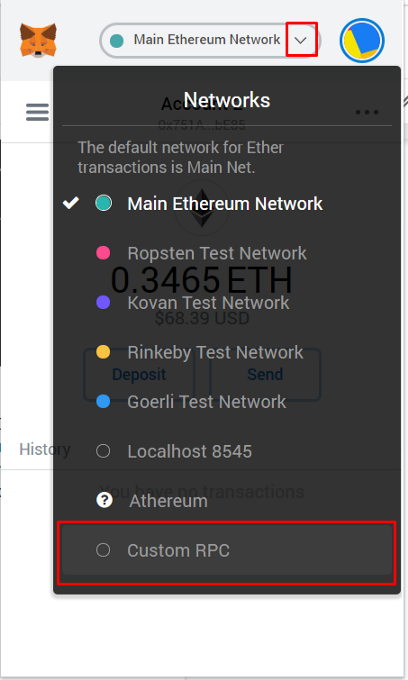

We will deploy our contracts on FUJI testnet.
FUJI Testnet Settings:

- Network Name: Avalanche FUJI C-Chain
- New RPC URL: https://api.avax-test.network/ext/bc/C/rpc
- ChainID: 43113
- Symbol: AVAX
- Explorer: https://cchain.explorer.avax-test.network

You may find the configurations for the Avalanche Mainnet and Local Testnet (AVASH) [here](https://docs.avax.network/build/tutorials/smart-contracts/deploy-a-smart-contract-on-avalanche-using-remix-and-metamask#step-1-setting-up-metamask)

Next, we will add the network configuration in hardhat config file (`hardhat.config.js`). If you do not know how that file works then take a look at [here](https://hardhat.org/config/#networks-configuration)

```js
networks:{
    ...
    fuji: {
      url: "https://api.avax-test.network/ext/bc/C/rpc",
      chainId: 43113,
      accounts: [
        "PRIVATE_KEY",
      ],
    },
}
```

Lastly we will need some AVAX to deploy our contracts. Use this [AVAX Fuji Testnet Faucet
](https://faucet.avax-test.network/) to get some test AVAX for free.

# Deploying the contracts

We need to deploy our `NFT` and `AuctionManager` contracts to Fuji Testnet. We will use hardhat to deploy the contracts, [learn more about it here](https://hardhat.org/guides/deploying.html). Let's edit `scripts/deploy.js`

```js
const main = async () => {
  const NftToken = await ethers.getContractFactory("NFT"); // NFT token contract
  const nftToken = await NftToken.deploy(); // NFT token contract instance
  await nftToken.deployed(); // wait for contract to be deployed
  const nftTokenAddress = await nftToken.address; // NFT token contract address

  const AuctionManager = await ethers.getContractFactory("AuctionManager"); // Auction Manager contract
  const auctionManager = await AuctionManager.deploy(); // Auction Manager contract instance
  await auctionManager.deployed(); // wait for contract to be deployed
  const auctionManagerAddress = await auctionManager.address; // Auction Manager contract address

  console.log(`NFT deployed to: ${nftTokenAddress}`); // NFT token contract address
  console.log(`Auction Manager deployed to: ${auctionManagerAddress}`); // Auction Manager contract address
};

main()
  .then(() => process.exit(0))
  .catch((error) => {
    console.error(error);
    process.exit(1);
  });
```

After you are done editing `deploy.js`, let's run the script.

```console
$ npx hardhat compile
$ npx hardhat run scripts/deploy.js --network fuji
```

Pretty simple! If this looks unfamiliar to you, you shall take a look at [hardhat guides](https://hardhat.org/guides/deploying.html).

Do not forget to note the addresses, as we will need them afterward to interact with the contracts.


# React App

Let's build an interface to interact with our marketplace. We are going to use `react` and `ether.js`.

```bash
create-react-app frontend
cd frontend
npm install --save ethers
npm run start
```

Add bootstrap CDN in `public/index.html` file. We will use bootstrap to speed up.

```diff
<head>
  ...
+  <link
+    rel="stylesheet"
+    href="https://stackpath.bootstrapcdn.com/bootstrap/4.4.1/css/bootstrap.min.css"
+  />
</head>
...
</body>
+ <script src="https://code.jquery.com/jquery-3.4.1.slim.min.js"></script>
+ <script src="https://cdn.jsdelivr.net/npm/popper.js@1.16.0/dist/umd/popper.min.js"></script>
+ <script src="https://stackpath.bootstrapcdn.com/bootstrap/4.4.1/js/bootstrap.min.js"></script>
</html>
```

Let's start with a fresh `App.js` file. Start by importing `ethers` and assigning the contract addresses to constant strings. Since there aren't any auctions yet, we need to create one first. However, before creating an auction, we need to mint an NFT.

```js
import React from "react";
import { ethers } from "ethers";
const NFT_ADDRESS = "0x924E1374E01Df9581f4C891Fb3458f07Ca2f95D5";
const AUCTIONMANAGER_ADDRESS = "0x92C77926D261A3AE695ceC62DB2E48567736E161";
class App extends React.Component {
  constructor(props) {
    super(props);
    this.state = {
      auctions: [], // Auctions to display
      newAuction: {
        // newAuction is a state variable for the form
        startPrice: null,
        endTime: null,
        tokenId: null,
        minIncrement: null,
        directBuyPrice: null,
      },
      myItems: [],
    };
  }
  render() {
    return (
      <div>
        <div class="jumbotron d-flex align-items-center">
          <div class="container">
            <div class="auctions row"></div>
          </div>
        </div>
        <div class="container">
          <form>
            <button type="submit" class="btn btn-primary">
              Create Auction
            </button>
          </form>
          <button class="btn btn-fanger">Mint NFT</button>
          <p>
            Your items
            <br />
            {(this.state.myItems || [""]).map((x) => `id: ${x} `) || ""}
          </p>
        </div>
      </div>
    );
  }
}
export default App;
```

## Building the form

We need to add few elements to our form. The user has to type in the start price, token id, minimum increment, how many minutes the auction will last and the direct buy price.

```js
<form>
  <div class="mb-3">
    <label for="startprice" class="form-label">
      Start Price
    </label>
    <input
      value={this.state.newAuction.startPrice}
      onChange={(e) =>
        this.setState({
          newAuction: {
            ...this.state.newAuction,
            startPrice: parseInt(e.target.value),
          },
        })
      }
      type="number"
      class="form-control"
      id="startprice"
    />
    <label for="startprice" class="form-label">
      Token Id
    </label>
    <input
      value={this.state.newAuction.tokenId}
      onChange={(e) =>
        this.setState({
          newAuction: {
            ...this.state.newAuction,
            tokenId: parseInt(e.target.value),
          },
        })
      }
      type="number"
      class="form-control"
      id="startprice"
    />
    <label class="form-label">Minimum Increment</label>
    <input
      value={this.state.newAuction.minIncrement}
      onChange={(e) =>
        this.setState({
          newAuction: {
            ...this.state.newAuction,
            minIncrement: parseInt(e.target.value),
          },
        })
      }
      type="number"
      class="form-control"
    />
    <label class="form-label">Direct Buy Price</label>
    <input
      value={this.state.newAuction.directBuyPrice}
      onChange={(e) =>
        this.setState({
          newAuction: {
            ...this.state.newAuction,
            directBuyPrice: parseInt(e.target.value),
          },
        })
      }
      type="number"
      class="form-control"
    />

    <label class="form-label">Duration In Minutes</label>
    <input
      value={this.state.newAuction.endTime}
      onChange={(e) =>
        this.setState({
          newAuction: {
            ...this.state.newAuction,
            endTime: parseInt(e.target.value),
          },
        })
      }
      type="number"
      class="form-control"
    />
  </div>

  <button
    type="button"
    onClick={() => console.log(this.state.newAuction)}
    class="btn btn-primary"
  >
    Create Auction
  </button>
</form>
```

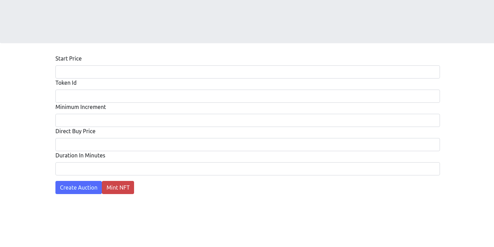

Our form is ready! Let's see how we are going to interact with the contracts.

## Interacting with contracts

### Contract ABI's

We will use Contract Application Binary Interface (ABI) to interact with the contracts. It is the standard way to do it.
You can find the `ABI` of compile contracts in `artifacts/contracts/ContractName/ContractName.json`
Let's create a `frontend/src/artifacts` folder and move all those `json` files in there so we can reach them easier within the react code.

```console
mkdir frontend/src/artifacts
mv artifacts/contracts/Auction.sol/Auction.json frontend/src/artifacts/Auction.json
mv artifacts/contracts/NFT.sol/NFT.json frontend/src/artifacts/NFT.json
mv artifacts/contracts/AuctionManager.sol/AuctionManager.json frontend/src/artifacts/AuctionManager.json
```

Let's import them in the react code.

```js
import AuctionArtifact from "./artifacts/Auction.json";
import AuctionManagerArtifact from "./artifacts/AuctionManager.json";
import NFTArtifact from "./artifacts/NFT.json";
```

### Detecting and connecting to metamask

Let's add an `init` function which we will call when the page is loaded.

```js
class App extends React.Component {
  async init(){}
...
}
```

We will use (ethers)[https://docs.ethers.io/v5/] to connect our metamask wallet and call the `init` function on `componentDidMount`.

```js
class App extends React.Component {
  ...
  async init() {
    if (window.ethereum) {
      await window.ethereum.enable(); // Enable the Ethereum client
      this.provider = new ethers.providers.Web3Provider(window.ethereum); // A connection to the Ethereum network
      this.signer = this.provider.getSigner(); // Holds your private key and can sign things
      this.setState({ currentAddress: this.signer.getAddress() }); // Set the current address
      this._auctionManager = new ethers.Contract( // We will use this to interact with the AuctionManager
        AUCTIONMANAGER_ADDRESS,
        AuctionManagerArtifact.abi,
        this.signer
      );

      this._nft = new ethers.Contract( // We will use this to interact with the NFT contract
        NFT_ADDRESS,
        NFTArtifact.abi,
        this.signer
      );
    } else {
      alert("No wallet detected");
    }
  }
  componentDidMount() {
    this.init();
  }
  ...
}
```

Inside the init function we are creating instances of the signer, auction manager contract and our NFT contract. We will use them later.

[See here to learn more about ethers](https://docs.ethers.io/v5/getting-started/)
Let's refresh the page now, metamask should prompt you to connect your account.

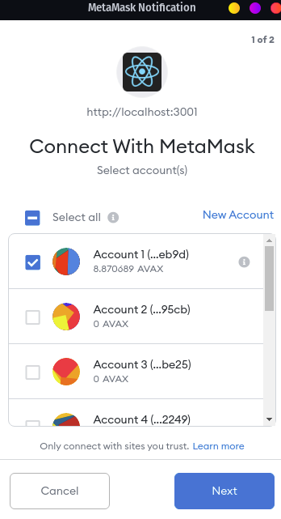
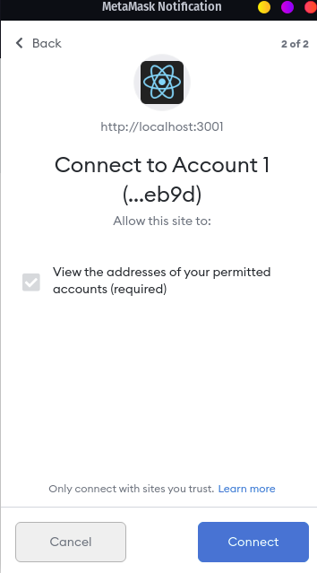

Choose your account and continue.
Congrats! We have connected metamask to our website.

## Minting an NFT

Let's build the mint function, which we will call when the `Mint NFT` button is pressed.

We are going to use the `this.nft` object which we created inside the init function earlier.
There is a function named `getItem()` inside our NFT contract. We have to call it and pass 0.5 AVAX to create an NFT.

```js
async mint() {
  // hash is the hash of the transaction
  let { hash } = await this._nft.getItem({
    // Calling the getItem function of the contract
    value: ethers.utils.parseEther("0.5"), // 0.5 AVAX
  });
  console.log("Transaction sent! Hash:", hash);
  await this.provider.waitForTransaction(hash); // Wait till the transaction is mined
  console.log("Transaction mined!");
  alert(`Transaction sent! Hash: ${hash}`);
}
```

And call this function when the button is pressed.

```js
<button type="button" onClick={() => this.mint()} class="btn btn-danger">
  Mint NFT
</button>
```

Then click the Mint NFT button on the web page.

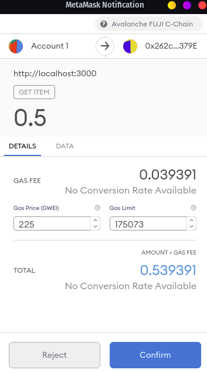

Confirm the transaction. After a few seconds the transaction should get mined.

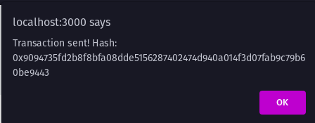

Congrats! We have just minted ourselves an NFT token! I will mint myself two more. You can do as many as you want!

## Owned NFT's

We will use the `myItems` function in the NFT contract to retrieve a list of tokens that we own.

```js
async getItems() {
  let items = await this._nft.myItems(); // Get the tokens owned by the user
  console.log(items);
}
```

Let's call this function at the end of the `init()` function, so each time the wallet is connected, we will retrieve the list of items owned by that wallet.

```diff
  async init() {
    if (window.ethereum) {
      // if window.ethereum is defined
      await window.ethereum.enable(); // Enable the Ethereum client
      this.provider = new ethers.providers.Web3Provider(window.ethereum); // A connection to the Ethereum network
      this.signer = this.provider.getSigner(); // Holds your private key and can sign things

      this._auctionManager = new ethers.Contract( // We will use this to interact with the AuctionManager
        AUCTIONMANAGER_ADDRESS,
        AuctionManagerArtifact.abi,
        this.signer
      );

      this._nft = new ethers.Contract( // We will use this to interact with the NFT
        NFT_ADDRESS,
        NFTArtifact.abi,
        this.signer
      );

+     this.getItems();
    } else {
      alert("No wallet detected"); // No wallet detected
    }
  }
```

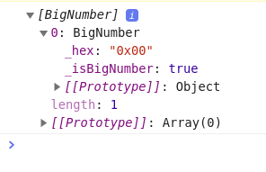

If you reload the page and take a look at the developer console, you may notice that the array contains values in `BigNumber` format. We have to convert them to normal numbers.

```js
async getItems() {
  let items = await this._nft.myItems(); // Get the tokens owned by the user
  items = items.map((x) => x.toNumber()); // Converts BigNumber to number for each item in array
  this.setState({ myItems: items });
}
```

Now let's refresh the page.

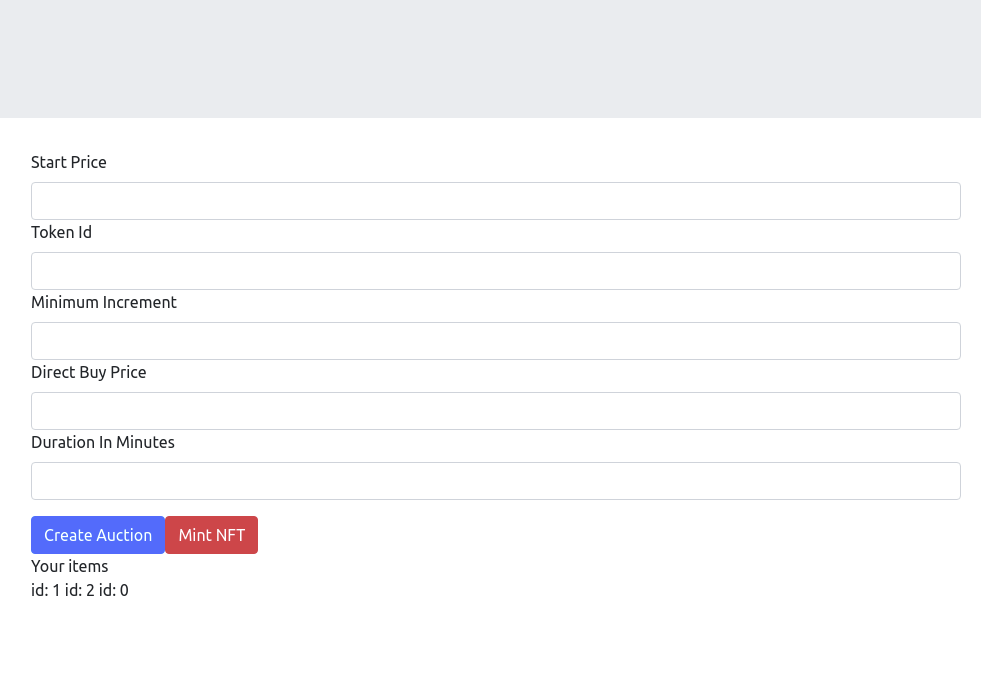

Here they are! I can see all the NFT's I've minted.

## Creating an auction

So far, so good! Let's build a function for creating auctions.
Before calling the `createAuction` function in the auction manager, first, we have to give approval for the token. Giving approval to the auction manager will let the auction manager transfer our token to the newly created auction contract.

Here are the steps.

- Check if there are any empty text fields.

```js
if (
  !this.state.newAuction.minIncrement ||
  !this.state.newAuction.directBuyPrice ||
  !this.state.newAuction.startPrice ||
  !this.state.newAuction.endTime ||
  !this.state.newAuction.tokenId
)
  return alert("Fill all the fields");
```

- We call the approve function to approve the `AuctionManager` contract to transfer the NFT token that we are going to take to the auction.

```js
let { hash: allowance_hash } = await this._nft.approve(
  AUCTIONMANAGER_ADDRESS,
  this.state.newAuction.tokenId
); // Approve the AUCTIONMANAGER to transfer the token
console.log("Approve Transaction sent! Hash:", allowance_hash);
await this.provider.waitForTransaction(allowance_hash); // Wait till the transaction is mined
console.log("Transaction mined!");
```

- Then, we will call the `createAuction` function in the `AuctionManager` contract.

```js
let { hash } = await this._auctionManager.createAuction(
  this.state.newAuction.endTime * 60, // Converting minutes to seconds
  ethers.utils.parseEther(this.state.newAuction.minIncrement.toString()), // Minimum increment in AVAX
  ethers.utils.parseEther(this.state.newAuction.directBuyPrice.toString()), // Direct buy price in AVAX
  ethers.utils.parseEther(this.state.newAuction.startPrice.toString()), // Start price in AVAX
  NFT_ADDRESS, // The address of the NFT token
  this.state.newAuction.tokenId // The id of the token
);
console.log("Transaction sent! Hash:", hash);
await this.provider.waitForTransaction(hash); // Wait till the transaction is mined
console.log("Transaction mined!");
alert(`Transaction sent! Hash: ${hash}`);
```

Final function

```js
async createAuction() {
    if (
      !this.state.newAuction.minIncrement ||
      !this.state.newAuction.directBuyPrice ||
      !this.state.newAuction.startPrice ||
      !this.state.newAuction.endTime ||
      !this.state.newAuction.tokenId
    )
      return alert("Fill all the fields");

    let { hash: allowance_hash } = await this._nft.approve(
      AUCTIONMANAGER_ADDRESS,
      this.state.newAuction.tokenId
    ); // Approve the AUCTIONMANAGER to transfer the token
    console.log("Approve Transaction sent! Hash:", allowance_hash);
    await this.provider.waitForTransaction(allowance_hash); // Wait till the transaction is mined
    console.log("Transaction mined!");

    let { hash } = await this._auctionManager.createAuction(
      // Create an auction
      this.state.newAuction.endTime * 60, // Converting minutes to seconds
      ethers.utils.parseEther(this.state.newAuction.minIncrement.toString()), // Minimum increment in AVAX
      ethers.utils.parseEther(this.state.newAuction.directBuyPrice.toString()), // Direct buy price in AVAX
      ethers.utils.parseEther(this.state.newAuction.startPrice.toString()), // Start price in AVAX
      NFT_ADDRESS, // The address of the NFT token
      this.state.newAuction.tokenId // The id of the token
    );
    console.log("Transaction sent! Hash:", hash);
    await this.provider.waitForTransaction(hash); // Wait till the transaction is mined
    console.log("Transaction mined!");
    alert(`Transaction sent! Hash: ${hash}`);
}
```

Now let's call this function when the `Create Auction` button is pressed.

```diff
...
<button
  type="button"
+ onClick={() => this.createAuction()}
  class="btn btn-primary"
>
  Create Auction
</button>
...
```

We are ready to start our first auction! Let's fill the form and press on `Create Auction` button.


Approve the auction manager contract to transfer the NFT token with ID 2.


Start the auction!


And that's it, we have just started our first auction on our NFT marketplace.

## Getting the list of auctions

Let's build a function to get a list of all auctions.

We will use two functions from our `AuctionManager` contract to achieve this, `getAuctions()` and `getAuctionInfo()`.

By calling the `getAuctions()` function, we will get a list of contract addresses of all the auctions on the marketplace. Next, we will call the `getAuctionInfo()` function and pass an array of auction addresses that we would like to obtain information.

```js
async getAuctions() {
  let auctionsAddresses = await this._auctionManager.getAuctions(); // get a list of auction addresses
  let auctions = await this._auctionManager.getAuctionInfo(auctionsAddresses); // I'll just pass all the addresses here, you can build a pagination system if you want
  console.log("Auctions:", auctions);
  this.setState({ auctions }); // Update the state
}
```

We should call this function at the end of the `init()` function.

```diff
  ...
  this._nft = new ethers.Contract(NFT_ADDRESS, NFTArtifact.abi, this.signer); // We will use this to interact with the NFT
  this.getItems();
+ this.getAuctions();
  ...
```

Now let's take a look at the developer console logs.


The numbers are again in big number format. We can convert the `tokenId` and `endTime` using `.toNumber()` method; however, for the BigNumbers that represent a price, we should use `ethers.utils.formatEther` to get the exact value in AVAX.

Let's organize the auction array and display them in the auctions section of the web page.

```js
let new_auctions = [];

for (let i = 0; i < auctions.endTime.length; i++) {
  let endTime = auctions.endTime[i].toNumber();
  let tokenId = auctions.tokenIds[i].toNumber();
  let auctionState = auctions.auctionState[i].toNumber();

  let startPrice = ethers.utils.formatEther(auctions.startPrice[i]);
  let directBuyPrice = ethers.utils.formatEther(auctions.directBuy[i]);
  let highestBid = ethers.utils.formatEther(auctions.highestBid[i]);

  let owner = auctions.owner[i];

  let newAuction = {
    endTime: endTime,
    startPrice: startPrice,
    owner: owner,
    directBuyPrice: directBuyPrice,
    tokenId: tokenId,
    highestBid: highestBid,
    auctionState: auctionState,
    auctionAddress: auctionsAddresses[i],
  };
  new_auctions.push(newAuction);
}

this.setState({ auctions: new_auctions }); // Update the state
```

Now let's write a function to display an auction.

```js
renderAuctionElement(auction) {
  let state = "";
  if (auction.auctionState === 0) {
    state = "Open";
  }
  if (auction.auctionState === 1) {
    state = "Cancelled";
  }
  if (auction.auctionState === 2) {
    state = "Ended";
  }
  if (auction.auctionState === 3) {
    state = "Direct Buy";
  }
  return (
    <div style={{ background: "yellow" }} class="col">
      <p>ID: {auction.tokenId}</p> {/* ID of the token */}
      <p>Highest Bid: {auction.highestBid || 0}</p>
      {/* Highest bid */}
      <p>Direct Buy: {auction.directBuyPrice}</p> {/* Direct buy price */}
      <p>Starting Price: {auction.startPrice}</p> {/* Starting price */}
      <p>Owner: {auction.owner}</p> {/* Owner of the token */}
      <p>
        End Time: {Math.round((auction.endTime * 1000 - Date.now()) / 1000 / 60)}{" "}
        {/* Time left in minutes */}
        minutes
      </p>
      <p>Auction State: {state}</p>
      <button class="btn-primary">See More</button>
    </div>
  );
}
```

We have converted the `auction.endTime`, which is in seconds, to milliseconds by multiplying by 1000. Then, we have subtracted the result from `Date.now()`, which is in milliseconds. After that, we divided the result by 1000 to convert it to seconds. Finally, we divided it by 60 to convert it to minutes.

Next, we will map all the auctions into the function in our `render` method.

```js
render() {
  return (
    <div class="jumbotron d-flex align-items-center">
      <div class="container">
        <div class="auctions row">
            {this.state.auctions.map(this.renderAuctionElement)}
        </div>
      </div>
    </div>
  )
}
```

Let's see the result!

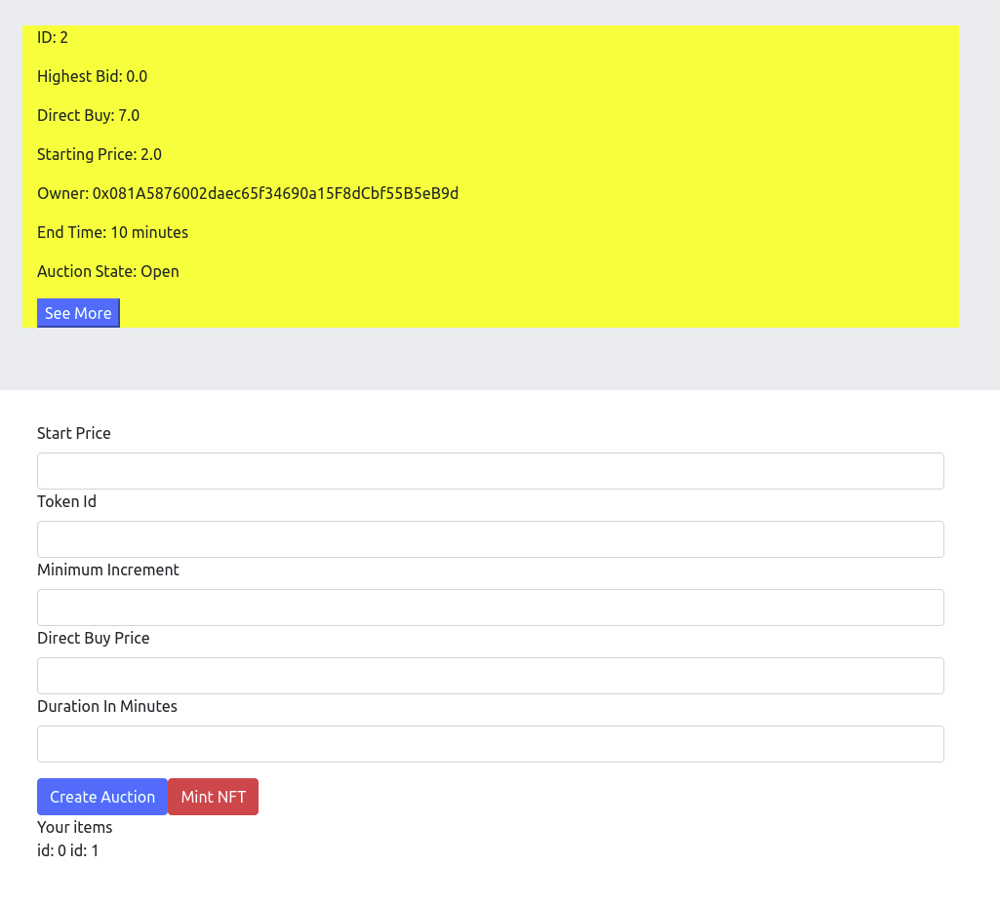

Awesome! There is the auction we've just created. Now let's build the auction page.

## Building the auction page

We'll use a state variable `this.state.activeAuction` to display the current auction. We will set this variable when the `See More` button is pressed. If this variable is not null, the auction information will be rendered instead of the list of auctions. We will set this variable back to null by using a go-back button.

This is not a good practice to do it this way, you should probably use React Navigation, but since this is just a demo, we are doing it this way.

Add a new `setActiveAuction` function

```js
setActiveAuction(auction) {
  this.setState({ activeAuction: auction });
}
```

It will call the function when the button is pressed.

```js
  ...
  <p>Auction State: {state}</p>
  <button class="btn-primary" onClick={() => this.setActiveAuction(auction)}>See More</button>
</div>
...
```

We would like to display the previous bids for a specific auction. Let's fetch that data when the `setActiveAuction` is called.

```js
async setActiveAuction(auction) {
  this._auction = new ethers.Contract( // Create a new instance of the contract
    auction.auctionAddress,
    AuctionArtifact.abi,
    this.signer
  );

  let previousBids = await this._auction.allBids(); // Get the bids
  let bids = []; // A list of bids
  for (let i = 0; i < previousBids[0].length; i++) { // Loop through the bids
    bids.push({ // Add the bid to the list
      bidder: previousBids[0][i], // The bidder
      bid: ethers.utils.formatEther(previousBids[1][i]), // The bid
    });
  }

  auction.bids = bids; // Add the bids array to the auction object

  this.setState({ activeAuction: auction }); // Update the state
}
```

Later, we will use the `this._auction` to interact with the auction contract. That's why we have made it accessible from `this`.

Do you remember that we have assigned a random value to every minted NFT? Let's also display that value on the auction page.

```js
let auctionTokenValue = await this._nft.itemValue(auction.tokenId); // Get the value of the token
auctionTokenValue = auctionTokenValue.toNumber(); // Convert BigNumber to number
auction.auctionTokenValue = auctionTokenValue; // Add the value of the token to the auction object
```

We should also know who is the highest bidder.

```js
let highestBidder = await this._auction.maxBidder(); // Get the highest bidder
auction.highestBidder = highestBidder; // Add the highest bidder to the auction object
```

Lastly the minimum increment value.

```js
let minIncrement = await this._auction.minIncrement(); // Get the minimum increment
auction.minIncrement = ethers.utils.formatEther(minIncrement); // Add the minimum increment to the auction object
```

The complete function.

```js
async setActiveAuction(auction) {
  console.log(auction);
  this._auction = new ethers.Contract( // Create a new instance of the contract
    auction.auctionAddress,
    AuctionArtifact.abi,
    this.signer
  );

  let previousBids = await this._auction.allBids(); // Get the bids
  let bids = []; // A list of bids
  for (let i = 0; i < previousBids[0].length; i++) {
    // Loop through the bids
    bids.push({
      // Add the bid to the list
      bidder: previousBids[0][i], // The bidder
      bid: ethers.utils.formatEther(previousBids[1][i]), // The bid
    });
  }

  auction.bids = bids; // Add the bids array to the auction object

  let auctionTokenValue = await this._nft.itemValue(auction.tokenId); // Get the value of the token
  auctionTokenValue = auctionTokenValue.toNumber(); // Convert BigNumber to number
  auction.auctionTokenValue = auctionTokenValue; // Add the value of the token to the auction object

  let highestBidder = await this._auction.maxBidder(); // Get the highest bidder
  auction.highestBidder = highestBidder; // Add the highest bidder to the auction object

  let minIncrement = await this._auction.minIncrement(); // Get the minimum increment
  auction.minIncrement = ethers.utils.formatEther(minIncrement); // Add the minimum increment to the auction object

  this.setState({ activeAuction: auction }); // Update the state
}
```

### Rendering the selected auction

Let's build a simple render function for the selected auction.

```js
renderActiveAuction() {
  let activeAuction = this.state.activeAuction;
  let state = "";
  if (activeAuction.auctionState === 0) {
    state = "Open";
  }
  if (activeAuction.auctionState === 1) {
    state = "Cancelled";
  }
  if (activeAuction.auctionState === 2) {
    state = "Ended";
  }
  if (activeAuction.auctionState === 3) {
    state = "Direct Buy";
  }
  return (
    <div>
      <div class="col">
        <button
          class="btn-secondary"
          onClick={() => this.setState({ activeAuction: null })}
        >
          Go Back
        </button>
        <p>ID: {activeAuction.tokenId}</p> {/* ID of the token */}
        <p>Highest Bid: {activeAuction.highestBid || 0} AVAX</p>
        {/* Highest bid */}
        <p>Direct Buy: {activeAuction.directBuyPrice} AVAX</p>{" "}
        {/* Direct buy price */}
        <p>Minimum Increment: {activeAuction.minIncrement} AVAX</p>{" "}
        {/* Minimum increment in AVAX */}
        <p>Starting Price: {activeAuction.startPrice} AVAX</p> {/* Starting price */}
        <p>Owner: {activeAuction.owner}</p> {/* Owner of the token */}
        <p>
            End Time:{" "}
            {Math.round(
              (activeAuction.endTime * 1000 - Date.now()) / 1000 / 60
            )}{" "}
            {/* Time left in minutes */}
            minutes
        </p>
        <p>Auction State: {state}</p>
      </div>
      <div class="col">
        <h3>Bids</h3>
        <table class="table">
          <thead>
            <tr>
              <th>Bidder</th>
              <th>Bid</th>
            </tr>
          </thead>
          <tbody>
            {activeAuction.bids.map((bid) => {
              return (
                <tr key={bid.bidder}>
                  <td>{bid.bidder}</td>
                  <td>{bid.bid} AVAX</td>
                </tr>
              );
            })}
          </tbody>
        </table>
      </div>
      <div class="col">
        <div>
          <input type="number" placeholder="0.5" />
          <button class="btn-primary">Place Pid</button>
        </div>
        <button class="btn-danger">Cancel Auction</button>
        <button class="btn-secondary">Withdraw Funds</button>
        <button class="btn-secondary">Withdraw Token</button>
      </div>
    </div>
  );
}
```

If `this.state.activeAuction` is not null, then we will return this function instead of the list of auctions.

Inside the `render` function

```js
...
<div class="container">
  {this.state.activeAuction != null ? (
    this.renderActiveAuction()
  ) : (
    <div class="auctions row">
      {this.state.auctions.map(this.renderAuctionElement)}
    </div>
  )}
</div>
...
```


Now, we will have to make those buttons at the bottom functional.
Let's write a function for each one!

## Auction Functions

Remember the `this._auction` object we've set inside the `setActiveAuction` function? We will use that object to build our functions.

### Placing Bids

We will simply call the `placeBid` function on the Auction contract and pass some AVAX.

```js
async placeBid(amount) {
  if (!amount) return;
  amount = ethers.utils.parseEther(amount.toString()); // Amount in AVAX
  let { hash } = await this._auction.placeBid({ value: amount }); // Place a bid
  await this.provider.waitForTransaction(hash); // Wait till the transaction is mined
  alert(`Transaction sent! Hash: ${hash}`); // Show the transaction hash
  this.setActiveAuction(this.state.activeAuction); // Update the active auction
}
```

Next, let's call this function when the button is pressed.

```js
...
  <div>
    <input
      type="number"
      placeholder="0.5"
      onChange={(e) => this.setState({ bidAmount: e.target.value })}
    />
    <button
      class="btn-primary"
      onClick={() => this.placeBid(this.state.bidAmount)}
    >
      Place Pid
    </button>
  </div>
...
```

Before placing a bid, we must switch to another account on metamask since the auction creator cannot place bids. Do not forget to connect the account after you switch in metamask.

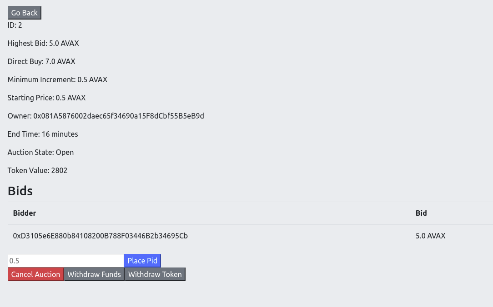

We've placed a bid on the auction!
Now let's wait a bit until the auction is over, then we can withdraw our new token if no one bids a higher value.

### Withdraw Token

Call the `withdrawToken` function of the Auction contract.

```js
async withdrawToken() {
  let { hash } = await this._auction.withdrawToken(); // Withdraw the NFT token
  await this.provider.waitForTransaction(hash); // Wait till the transaction is mined
  alert(`Withdrawal Successful! Hash: ${hash}`); // Show the transaction hash
  window.location.reload(); // Reload the page
}
```

Let's call this function when the `Withdraw Token` button is pressed.

```js
...
<button onClick={()=>this.withdrawToken()} class="btn-secondary">Withdraw Token</button>
...
```


After some time, the auction is finally over, and our bid is still the highest one. Let's withdraw our new NFT token.
Note: It would be nice to hide the end time when the auction is not open.

Approving the transaction...

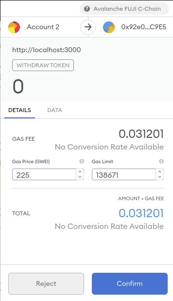

Refresh the page and we just got our new NFT!


### Withdraw Funds

Call the `withdrawFunds` function of the Auction contract.

```js
async withdrawFunds() {
  let { hash } = await this._auction.withdrawFunds(); // Withdraw the funds
  await this.provider.waitForTransaction(hash); // Wait till the transaction is mined
  alert(`Withdrawal Successful! Hash: ${hash}`); // Show the transaction hash
  window.location.reload(); // Reload the page
}
```

Let's call this function when the `Withdraw Funds` button is pressed.

```js
...
<button onClick={()=>this.withdrawFunds()} class="btn-secondary">Withdraw Funds</button>
...
```

Since the auction is already over, we can switch back to the account in which we created the auction and withdraw our funds.

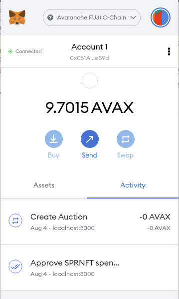

Then we will click on the `Withdraw Funds` button and confirm the transaction.

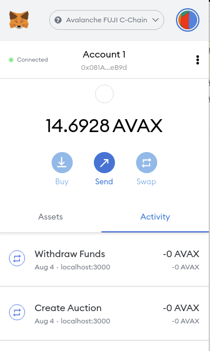

Awesome! We have just sold an NFT and earned some AVAX.

### Cancel Auction

Call the `cancelAuction` function of the Auction contract.

```js
async cancelAuction() {
  let { hash } = await this._auction.cancelAuction(); // Cancel the auction
  await this.provider.waitForTransaction(hash); // Wait till the transaction is mined
  alert(`Auction Canceled! Hash: ${hash}`); // Show the transaction hash
  window.location.reload(); // Reload the page
}
```

Let's call this function when the `Cancel Auction` button is pressed.

```js
...
<button onClick={() => this.cancelAuction()} class="btn-danger">
  Cancel Auction
</button>
...
```

We have to create a new auction to demonstrate this since we cannot cancel an auction that has been bid already.
Create a new auction, click on the `Cancel Auction` button and confirm the transaction.

After refreshing the page, we can see that the auction has been canceled.


We can also see that the token was sent back to use after we've canceled the auction.

## Polishing the buttons

We should hide the button if the button is not in function. For instance, the `Withdraw Funds` button is visible to all users; however, only the auction creator can call it when the auction is over. Thus, we must only make it visible if the auction is over and the user is the auction creator.

We will do some controls for each button and hide the button if the user is not able to call the function.

Please note that our contract already blocks the other users from calling `Withdraw Funds` function. Someone can call any external function of a contract, even if it's hidden on the web page. It is crucial to make the checks within the contract code.

We will use some booleans to make this easier.

```js
renderActiveAuction() {
    let activeAuction = this.state.activeAuction;

    let isOwner = this.state.currentAddress === activeAuction.owner; // Check if the current address is the owner
    let isAuctionOpen = state === "Open"; // Check if the auction is open
    let isAuctionCancelled = state === "Cancelled"; // Check if the auction is cancelled
    let isAuctionEnded = state === "Ended" || state === "Direct Buy"; // Check if the auction is ended
    ...
}
```

Now let's start with the place bid area.

### Place Bid Area

- Auction must be open.
- The auction creator cannot bid.

```js
{
  isAuctionOpen && !isOwner ? (
    <div>
      <input
        type="number"
        placeholder="0.5"
        onChange={(e) => this.setState({ bidAmount: e.target.value })}
      />
      <button
        class="btn-primary"
        onClick={() => this.placeBid(this.state.bidAmount)}
      >
        Place Pid
      </button>
    </div>
  ) : null;
}
```

### Cancel Auction Button

- There must be no bids.
- Auction must be open.
- The caller must be the auction creator.

```js
{
  isOwner && isAuctionOpen && activeAuction.bids.length == 0 ? (
    <button onClick={() => this.cancelAuction()} class="btn-danger">
      Cancel Auction
    </button>
  ) : null;
}
```

### Withdraw Funds Button

- Auction must be ended.
- The caller must be the auction creator.
- There must be at least one bid on the auction.

```js
{
  isOwner && isAuctionEnded && activeAuction.bids.length > 0 ? (
    <button onClick={() => this.withdrawFunds()} class="btn-secondary">
      Withdraw Funds
    </button>
  ) : null;
}
```

### Withdraw Token Button

- Auction must be ended.
- If there are any bids, the caller must be the highest bidder.
- If there are no bids, the caller must be the auction creator. (The auction creator must be able to withdraw the token if no one bids and the auction times out)

```js
{
  ((activeAuction.bids.length == 0 && isOwner) || isHighestBidder) &&
  isAuctionEnded ? (
    <button onClick={() => this.withdrawToken()} class="btn-secondary">
      Withdraw Token
    </button>
  ) : null;
}
```

All of the buttons

```js
<div class="col">
  {isAuctionOpen && !isOwner ? (
    <div>
      <input
        type="number"
        placeholder="0.5"
        onChange={(e) => this.setState({ bidAmount: e.target.value })}
      />
      <button
        class="btn-primary"
        onClick={() => this.placeBid(this.state.bidAmount)}
      >
        Place Pid
      </button>
    </div>
  ) : null}
  {isOwner && isAuctionOpen && activeAuction.bids.length == 0 ? (
    <button onClick={() => this.cancelAuction()} class="btn-danger">
      Cancel Auction
    </button>
  ) : null}

  {isOwner && isAuctionEnded ? (
    <button onClick={() => this.withdrawFunds()} class="btn-secondary">
      Withdraw Funds
    </button>
  ) : null}
  {isHighestBidder && isAuctionEnded ? (
    <button onClick={() => this.withdrawToken()} class="btn-secondary">
      Withdraw Token
    </button>
  ) : null}
</div>
```

## Finishing the React App

That's all we need to do. Now, we have a functional marketplace where we can create auctions and sell NFT's.
We had an attribute called `value` that is assigned randomly to each of the NFT's. We've displayed this attribute on the auction page.

If this were an image or any attribute else instead of an integer, we would still be able to display it by making a simple change in our code. For instance, to retrieve the metadata (image URL and other attributes) of a token, use the `tokenURI(uint256 tokenId)` function to get the token uri from the NFT contract. You may want to take a look at [`IERC721Metadata`](https://docs.openzeppelin.com/contracts/3.x/api/token/erc721#IERC721Metadata) to learn more about it.

# Using With Other NFT Contracts

Selling another NFT instead of creating a contract is possible. As you may have noticed, we have only used the `approve` and `transferFrom` functions to transfer the NFT to our Market Place contract. Those functions are a standard in ERC-721, so this marketplace is compatible with almost any NFT token.

# Next Steps

There are a couple of things to test and consider before going any further.

## Tests

- Does the direct buy working?
- Will the auction creator be able to withdraw the token if there are no bids and the auction times out?
- Does the minimum increment working correctly?
- And many more

Before deploying a contract to production, we should test every possible scenario, and it is very hard to do the test one by one on the UI. Instead, we should use [hardhat tests](https://hardhat.org/tutorial/testing-contracts.html), where we can create different scenarios and test all of them in a matter of seconds.

## Things to consider

- If the user sends more AVAX than the direct buy price, it does not get refunded.
  - Refund the extra AVAX if `msg.value` is greater than direct buy price.
- The website won't work if the user does not connect a wallet or doesn't have one.
  - To be able to call the view functions (get a list of auctions etc.) you can use a `provider`, [learn more about it here](https://docs.ethers.io/v4/api-providers.html)
- React App does not handle the error when a transaction fails.
  - When the transaction fails, maybe show a pop-up and tell the reason.
- And more

It's always good to give the user clear instructions and make them feel comfortable. You should look from a user's point of view and try to think of every possible scenario & outcome.

# Deploying to the Avalanche Mainnet

Deploying to Mainnet is the same as deploying to [Testnet](#avax-fuji-testnet); the only difference is that you have to pay real funds instead of test funds.

Again, we have to get the configurations for the Avalanche Mainnet from [here](https://docs.avax.network/build/tutorials/smart-contracts/deploy-a-smart-contract-on-avalanche-using-remix-and-metamask#avalanche-mainnet-settings) and add the network in our hardhat config file.

```js
networks:{
    ...
    mainnet: {
      url: "https://api.avax.network/ext/bc/C/rpc",
      chainId: 43114,
      accounts: [
        "PRIVATE_KEY",
      ],
    },
}
```

After that, we will run the deploy script just like we did when deploying to the test net.

```console
$ npx hardhat compile
$ npx hardhat run scripts/deploy.js --network mainnet
```

# Conclusion

You now have the basic knowledge to start your NFT Marketplace. Congrats!

Do not forget that the react app is made for the demonstration of interacting with the contracts and fetching data from them. A good marketplace would need a better design and a lot of work.

Open an issue and let me know if you have any questions.
